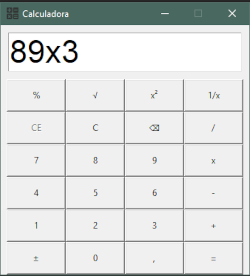

# Python 

Na pasta você encontra __*mais de 100 Exercícios*__ em linguagem __*Python*__

Veja: [Exercícios](https://github.com/lbbruno/Python/tree/main/Exercicios)
```
print("Enjoy!")
```

_*Obs: No diretório estão os arquivos contendo somente os códigos*_

## Projeto Calculadora
<p>
    [Clique Aqui](https://github.com/lbbruno/Python/tree/main/Projetos/Calculadora.py)
</p>
